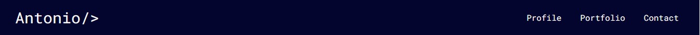

# Bootstrap-Portfolio

Welcome to my portfolio website! This space showcases my skills, projects, and experiences in a visually appealing and user-friendly format. Whether you're a potential employer, collaborator, or just curious about my work, this portfolio provides a glimpse into my professional journey.

The live site can be found [here.](https://totes7.github.io/Bootstrap-Portfolio/)

Below is a mock-up of the final product.

## Features

### Navbar

* The website is easy to navigate thanks to the navbar at the top of the page.
* The navbar is fixed to the top of the page even when scrolling down.

### Hero Banner

* This section contains an image and a banner containing my work title.
* There is also a button to open the contact section modal.

### Contact

* This section is in a modal. Here you can find my email address and links to my GitHub and LinkedIn accounts.

### Profile

* This section contains a brief intro about myself and my development.

### Skills

* This section contains the list of skills I honed so far.

### Portfolio

* This is the main section of the page, where you can find cards with links for all my project so far.

### Footer

* The footer contains another button to open the contact section modal.

## Deployment

* The site was deployed to GitHub Pages. The steps required are as follows:
    * From the GitHub main repository, navigate to Settings page.
    * Locate the Pages section.
    * Here, select Main Branch from the drop-down menu.
    * Once selected, GitHub will generate a link to the complete website.

## Technologies Used

### Languages Used

* [HTML5](https://en.wikipedia.org/wiki/HTML5)
* [CSS3](https://en.wikipedia.org/wiki/CSS)
* [Markdown](https://en.wikipedia.org/wiki/Markdown)

## Media

* The portfolio cards images are screenshots of the live site.
* The icons are from [FontAwsome.](https://fontawesome.com/icons)

## License

N/A
